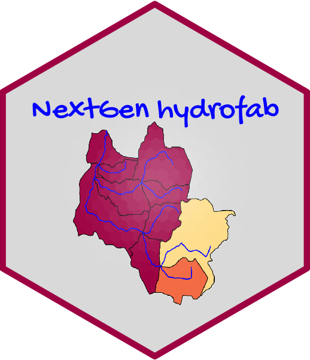

<!-- README.md is generated from README.Rmd. Please edit that file -->

# ngen.hydrofab: Fabricating Hydrofabrics for use with NextGen 

<!-- badges: start -->

[](#)
<!-- badges: end -->

The goal of `ngen.hydrofab` is to provide consistent hydrologic and
hydraulic network manipulation tool chains to build nextgen ready
hydrofabric products.

``` r
library(hydrofab)
library(ngen.hydrofab)
library(glue)

base = '/Volumes/Transcend/ngen/CONUS-hydrofabric/'
VPU = "01"

outfile = glue("{base}nextgen/nextgen_{VPU}.gpkg")


# Read Uniform Hydrofabric for VPU 01 and apply nexus toplogy, build crosswalk ect
ngen = get_hydrofabric(VPU = VPU, 
                        type = "uniform",
                        dir = glue("{base}uniform"),
                        overwrite = FALSE) %>% 
  apply_nexus_topology()

# Add flowpath attributes fro routing
ngen$flowpath_attributes <-  length_average_routelink(flowpaths = ngen$flowpaths,
                                                     rl_path = get_routelink_path())

# Write all layers to gpkg, add CFE and NOAHOWP attributes, then add AORC weight map
write_hydrofabric(ngen, outfile) %>% 
  
  aggregate_cfe_noahowp(dir  = '/Volumes/Transcend/nwmCONUS-v216/',
                        add_to_gpkg         = TRUE,
                        add_weights_to_gpkg = TRUE) %>% 
  
  add_grid_mapping(template  = "AORC-OWP_2012063021z.nc4",
                   grid_name = "aorc_weights")
```

``` r
# See what was built
sf::st_layers(outfile)
#> Driver: GPKG 
#> Available layers:
#>               layer_name geometry_type features fields             crs_name
#> 1              flowpaths   Line String    18521      9 NAD83 / Conus Albers
#> 2                divides       Polygon    22571      4 NAD83 / Conus Albers
#> 3                  nexus         Point     9158      3 NAD83 / Conus Albers
#> 4    flowpath_attributes            NA    18521     15                 <NA>
#> 5     flowpath_edge_list            NA    27679      2                 <NA>
#> 6              crosswalk            NA    66069      8                 <NA>
#> 7         nwm1km_weights            NA   359095      3                 <NA>
#> 8 cfe_noahowp_attributes            NA    20546     32                 <NA>
#> 9           aorc_weights            NA   540452      3                 <NA>
```

Nextgen is not yet ready to leverage geopackage files so each layer of
the geopackage is exported as a geojson, json, or csv depending on
datatype:

``` r
write_ngen_dir(gpkg = outfile, dir = glue("{base}nextgen/nextgen_{VPU}"))
```

``` r
#See what was made:
fs::dir_tree(dir)
#> /Volumes/Transcend/ngen/CONUS-hydrofabric/nextgen/nextgen_01
#> ├── aorc_weight_grids.csv
#> ├── catchment_data.geojson
#> ├── cfe_noahowp_attributes.csv
#> ├── crosswalk.csv
#> ├── flowpath_attributes.json
#> ├── flowpath_edge_list.json
#> ├── flowpath_params.json
#> └── nexus_data.geojson
```
